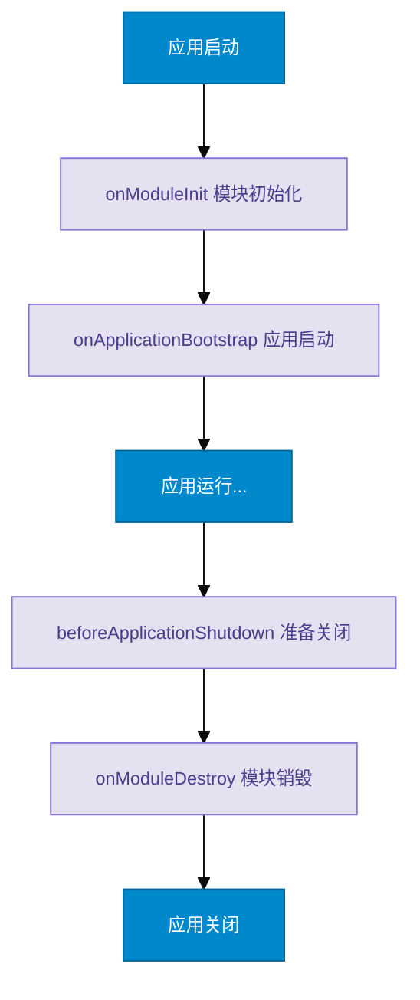

# Cute NestJS

一个轻量级的类 NestJS 框架实现，专注于实现 NestJS 的核心特性，更好地学习、理解 NestJS 的设计理念和实现原理。

## 项目介绍

Cute NestJS 是一个基于 TypeScript 的轻量级框架，它模仿了 NestJS 的核心设计理念，但以更简单的方式实现。这个项目的目标是：

1. 帮助开发者更好的理解 NestJS 的核心概念和设计模式
2. 提供一个最小化但功能相对完整的依赖注入系统
3. 实现基本的模块化和装饰器支持

## 快速开始

### 1. 创建一个模块
```typescript
@Module({
  controllers: [AppController],
  providers: [AppService]
})
export class AppModule {}
```

### 2. 创建一个服务
```typescript
@Injectable()
export class AppService {
  getHello(): string {
    return 'Hello World!'
  }
}
```

### 3. 创建一个控制器
```typescript
@Controller('/app')
export class AppController {
  constructor(private readonly appService: AppService) {}

  @Get('/hello')
  getHello(): string {
    return this.appService.getHello()
  }
}
```

### 4. 启动应用
```typescript
async function bootstrap() {
  const app = await CuteNestFactory.create(AppModule)
  app.listen(3000, () => {
    console.log('Server running on http://localhost:3000')
  })
}

bootstrap()
```

## 核心特性

### 1. 依赖注入（DI）系统
- 基于装饰器的依赖注入
- 支持构造函数注入
- 支持属性注入
- 支持循环依赖处理

### 2. 装饰器支持
- 类装饰器：@Module(), @Injectable(), @Controller()
- 方法装饰器：@Get(), @Post() 等 HTTP 方法装饰器
- 参数装饰器：@Query(), @Param(), @Body()

### 3. 动态模块引用（ModuleRef）
ModuleRef 提供了在运行时动态操作依赖注入容器的能力：

#### 基本功能
- 获取Provider实例
- 动态创建新实例
- 异步解析Provider

#### 使用场景
- 动态模块加载
- 运行时依赖注入
- 延迟加载服务
- 请求作用域实例

#### 示例代码
```typescript
@Injectable()
class DynamicService {
  constructor(private moduleRef: ModuleRef) {}

  async createDynamicInstance() {
    // 获取已存在的实例
    const service = this.moduleRef.get(UserService);

    // 创建新的实例
    const newService = await this.moduleRef.create(CustomService);

    // 异步解析实例
    const scopedService = await this.moduleRef.resolve(
      RequestScopedService,
      requestId
    );
  }
}
```

### 生命周期钩子

#### 生命周期执行顺序



框架提供了完整的生命周期管理机制，每个钩子都有其特定的使用场景：

#### onModuleInit
- **触发时机**：模块初始化时
- **使用场景**：
  - 建立数据库连接
  - 加载配置文件
  - 初始化缓存
  - 预热数据
- **示例代码**：
```typescript
@Injectable()
class DatabaseService implements OnModuleInit {
  async onModuleInit() {
    // 初始化数据库连接
    await this.initializeDatabase()
    // 预热常用数据
    await this.warmupCache()
  }
}
```

#### onApplicationBootstrap
- **触发时机**：所有模块都初始化完成后
- **使用场景**：
  - 启动定时任务
  - 注册全局事件监听
  - 建立消息队列连接
  - 启动后台作业
- **示例代码**：
```typescript
@Injectable()
class TaskService implements OnApplicationBootstrap {
  async onApplicationBootstrap() {
    // 启动定时任务
    this.startCronJobs()
    // 订阅消息队列
    await this.subscribeToQueue()
  }
}
```

#### beforeApplicationShutdown
- **触发时机**：应用收到终止信号时
- **使用场景**：
  - 等待进行中的请求完成
  - 关闭外部服务连接
  - 保存临时数据
  - 发送关闭通知
- **示例代码**：
```typescript
@Injectable()
class HttpService implements BeforeApplicationShutdown {
  async beforeApplicationShutdown() {
    // 等待所有请求完成
    await this.waitForPendingRequests()
    // 关闭 HTTP 连接
    await this.closeConnections()
  }
}
```

#### onModuleDestroy
- **触发时机**：模块销毁前
- **使用场景**：
  - 清理模块内部资源
  - 取消定时任务
  - 关闭模块级连接
  - 清理内存缓存
- **示例代码**：
```typescript
@Injectable()
class CacheService implements OnModuleDestroy {
  async onModuleDestroy() {
    // 清理内存缓存
    this.clearCache()
    // 停止后台任务
    this.stopBackgroundJobs()
  }
}
```
