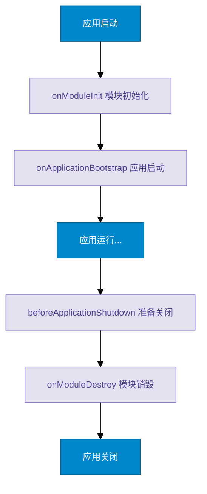
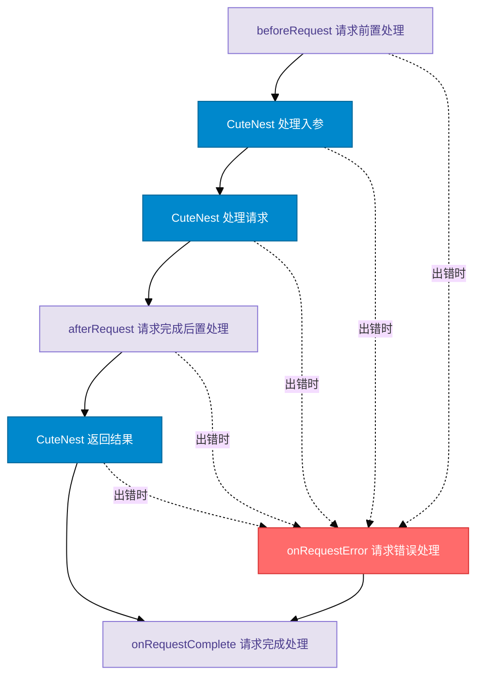

# Cute NestJS

一个轻量级的 NestJS 风格框架，提供了依赖注入、装饰器、中间件等核心功能。

## 项目介绍

Cute NestJS 是一个基于 TypeScript 的轻量级框架，它模仿了 NestJS 的核心设计理念，但以更简单的方式实现。这个项目的目标是：

1. 帮助开发者更好的理解 NestJS 的核心概念和设计模式
2. 提供一个最小化但功能相对完整的依赖注入系统
3. 实现基本的模块化和装饰器支持

## 特性

- 依赖注入容器
- 装饰器支持
- 中间件系统
- 生命周期钩子
- 可扩展的 HTTP 适配器
- 统一的错误处理
- 请求生命周期钩子

## 快速开始

### 1. 创建一个模块
```typescript
@Module({
  controllers: [AppController],
  providers: [AppService]
})
export class AppModule {}
```

### 2. 创建一个服务
```typescript
@Injectable()
export class AppService {
  getHello(): string {
    return 'Hello World!'
  }
}
```

### 3. 创建一个控制器
```typescript
@Controller('/app')
export class AppController {
  constructor(private readonly appService: AppService) {}

  @Get('/hello')
  getHello(): string {
    return this.appService.getHello()
  }
}
```

### 4. 启动应用
```typescript
async function bootstrap() {
  const app = await CuteNestFactory.create(AppModule)
  app.listen(3000, () => {
    console.log('Server running on http://localhost:3000')
  })
}

bootstrap()
```

## 核心特性

### 1. 依赖注入（DI）系统
- 基于装饰器的依赖注入
- 支持构造函数注入
- 支持属性注入
- 支持循环依赖处理

### 2. 装饰器支持
- 类装饰器：@Module(), @Injectable(), @Controller()
- 方法装饰器：@Get(), @Post() 等 HTTP 方法装饰器
- 参数装饰器：@Query(), @Param(), @Body()

### 3. 动态模块引用（ModuleRef）
ModuleRef 提供了在运行时动态操作依赖注入容器的能力：

#### 基本功能
- 获取Provider实例
- 动态创建新实例
- 异步解析Provider

#### 使用场景
- 动态模块加载
- 运行时依赖注入
- 延迟加载服务
- 请求作用域实例

#### 示例代码
```typescript
@Injectable()
class DynamicService {
  constructor(private moduleRef: ModuleRef) {}

  async createDynamicInstance() {
    // 获取已存在的实例
    const service = this.moduleRef.get(UserService);

    // 创建新的实例
    const newService = await this.moduleRef.create(CustomService);

    // 异步解析实例
    const scopedService = await this.moduleRef.resolve(
      RequestScopedService,
      requestId
    );
  }
}
```

## HTTP 适配器

提供可扩展的 HTTP 适配器机制，允许你自由选择底层的 HTTP 服务实现。默认使用 Koa 作为 HTTP 服务，你也可以实现自己的适配器来支持其他 HTTP 库。

### 使用默认的 Koa 适配器

```typescript
import { CuteNestFactory } from '@cute-nestjs/core'
import { AppModule } from './app-module'

async function bootstrap() {
  // 使用默认的 Koa 适配器
  const app = await CuteNestFactory.create(AppModule)
  await app.listen(3000)
}

bootstrap()
```

### 使用自定义适配器

```typescript
import { CuteNestFactory } from '@cute-nestjs/core'
import { AppModule } from './app-module'
import { ExpressAdapter } from './adapters/express-adapter'

async function bootstrap() {
  // 使用自定义的 Express 适配器
  const app = await CuteNestFactory.create(AppModule, {
    httpAdapter: ExpressAdapter
  })
  await app.listen(3000)
}

bootstrap()
```

### 实现自定义适配器

要实现自定义适配器，需要实现 `HttpAdapter` 接口：

```typescript
export interface HttpAdapter {
  // 获取底层服务器实例
  getInstance(): any
  
  // 注册全局中间件
  use(handler: any): void
  
  // 创建路由实例
  createRouter(): any
  
  // 注册路由
  registerRoute(method: string, path: string, handler: any): void
  
  // 应用路由中间件
  applyRouter(router: any): void
  
  // 获取请求参数
  getRequestParams(req: any): Record<string, string>
  
  // 获取查询参数
  getRequestQuery(req: any): Record<string, string | string[]>
  
  // 获取请求体
  getRequestBody(req: any): unknown
  
  // 设置响应
  setResponse(res: any, value: unknown): void
  
  // 启动 HTTP 服务
  listen(port: number, callback?: () => void): void
}
```

## 中间件系统

提供灵活的中间件系统，支持全局中间件、路由中间件和模块中间件。

### 创建中间件

```typescript
import { Injectable } from '@cute-nestjs/core'
import type { Middleware } from '@cute-nestjs/core'

@Injectable()
export class LoggerMiddleware implements Middleware {
  async use(ctx: any, next: () => Promise<void>) {
    const start = Date.now()
    console.log(`开始处理请求: ${ctx.method} ${ctx.url}`)
    
    await next()
    
    const ms = Date.now() - start
    console.log(`请求处理完成，耗时: ${ms}ms`)
  }
}
```

### 注册全局中间件

```typescript
async function bootstrap() {
  const app = await CuteNestFactory.create(AppModule)
  
  // 注册全局中间件
  app.use(new LoggerMiddleware())
  
  await app.listen(3000)
}
```

### 模块级中间件

```typescript
@Module({
  imports: [UsersModule],
  controllers: [AppController],
  providers: [AppService]
})
export class AppModule implements CuteNestModule {
  configure(consumer: MiddlewareConsumer) {
    consumer
      .apply(LoggerMiddleware)
      .forRoutes('users')
      .exclude('users/health')  // 排除特定路由
  }
}
```

### 中间件配置选项

中间件构建器提供了丰富的配置选项：

```typescript
consumer
  .apply(LoggerMiddleware, AuthMiddleware)  // 应用多个中间件
  .forRoutes(
    'users',                    // 字符串路径
    UsersController,           // 控制器类
    { path: 'posts', method: 'GET' }  // 路由配置对象
  )
  .exclude(
    'users/login',            // 排除登录路由
    'users/register/*'        // 支持通配符
  )
```

## 错误处理

框架提供了统一的错误处理机制，包括：

### HTTP 异常类

```typescript
// 抛出 400 错误
throw new BadRequestException('参数错误')

// 抛出 404 错误
throw new NotFoundException('用户不存在')

// 自定义错误信息
throw new HttpException('自定义错误', 400, 'CUSTOM_ERROR', {
  field: 'username',
  value: 'invalid'
})
```

### 错误过滤器

通过实现 `OnRequestError` 接口来自定义错误处理：

```typescript
@Injectable()
export class GlobalErrorFilter implements OnRequestError {
  async onRequestError(context: any, error: Error) {
    // 自定义错误处理逻辑
    return {
      status: 500,
      message: error.message,
      timestamp: new Date().toISOString()
    }
  }
}
```

### 应用生命周期理器

#### 生命周期执行顺序



应用生命周期管理机制中每个钩子都有其特定的使用场景：

#### onModuleInit
- **触发时机**：模块初始化时
- **使用场景**：
  - 建立数据库连接
  - 加载配置文件
  - 初始化缓存
  - 预热数据
- **示例代码**：
```typescript
@Injectable()
class DatabaseService implements OnModuleInit {
  async onModuleInit() {
    // 初始化数据库连接
    await this.initializeDatabase()
    // 预热常用数据
    await this.warmupCache()
  }
}
```

#### onApplicationBootstrap
- **触发时机**：所有模块都初始化完成后
- **使用场景**：
  - 启动定时任务
  - 注册全局事件监听
  - 建立消息队列连接
  - 启动后台作业
- **示例代码**：
```typescript
@Injectable()
class TaskService implements OnApplicationBootstrap {
  async onApplicationBootstrap() {
    // 启动定时任务
    this.startCronJobs()
    // 订阅消息队列
    await this.subscribeToQueue()
  }
}
```

#### beforeApplicationShutdown
- **触发时机**：应用收到终止信号时
- **使用场景**：
  - 等待进行中的请求完成
  - 关闭外部服务连接
  - 保存临时数据
  - 发送关闭通知
- **示例代码**：
```typescript
@Injectable()
class HttpService implements BeforeApplicationShutdown {
  async beforeApplicationShutdown() {
    // 等待所有请求完成
    await this.waitForPendingRequests()
    // 关闭 HTTP 连接
    await this.closeConnections()
  }
}
```

#### onModuleDestroy
- **触发时机**：模块销毁前
- **使用场景**：
  - 清理模块内部资源
  - 取消定时任务
  - 关闭模块级连接
  - 清理内存缓存
- **示例代码**：
```typescript
@Injectable()
class CacheService implements OnModuleDestroy {
  async onModuleDestroy() {
    // 清理内存缓存
    this.clearCache()
    // 停止后台任务
    this.stopBackgroundJobs()
  }
}
```

## 请求生命周期管理器



请求生命周期让你可以在请求的不同阶段执行自定义逻辑：

### 请求前处理（BeforeRequest）

在请求处理之前执行，可以用于：
- 请求参数验证
- 权限检查
- 日志记录
- 请求计时

```typescript
@Injectable()
export class RequestLogger implements BeforeRequest {
  async beforeRequest(context: any) {
    context.startTime = Date.now()
    console.log(`开始处理请求: ${context.method} ${context.url}`)
  }
}
```

### 请求后处理（AfterRequest）

在请求处理之后、发送响应之前执行，可以用于：
- 响应数据转换
- 添加通用响应字段
- 数据脱敏
- 性能统计

```typescript
@Injectable()
export class ResponseTransformer implements AfterRequest {
  async afterRequest(context: any, result: any) {
    return {
      code: 0,
      data: result,
      timestamp: Date.now()
    }
  }
}
```

### 错误处理（OnRequestError）

当请求处理过程中发生错误时执行，可以用于：
- 错误日志记录
- 错误响应格式化
- 错误通知
- 错误重试

```typescript
@Injectable()
export class ErrorLogger implements OnRequestError {
  async onRequestError(context: any, error: Error) {
    console.error(`请求处理错误: ${error.message}`, {
      url: context.url,
      method: context.method,
      params: context.params
    })
  }
}
```

### 请求完成处理（OnRequestComplete）

在请求完全处理完成后执行，可以用于：
- 清理资源
- 性能日志记录
- 请求统计
- 资源释放

```typescript
@Injectable()
export class RequestMetrics implements OnRequestComplete {
  async onRequestComplete(context: any) {
    const duration = Date.now() - context.startTime
    console.log(`请求处理完成，耗时: ${duration}ms`)
  }
}
```
